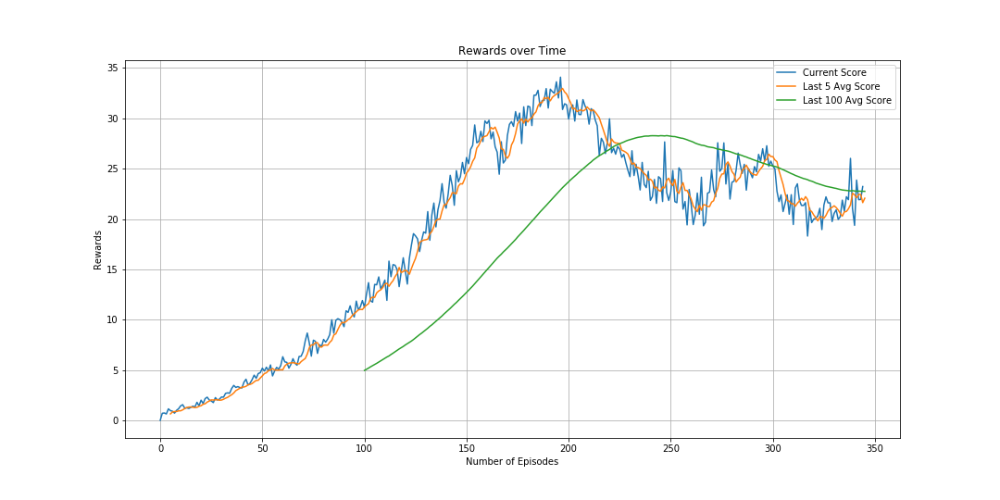
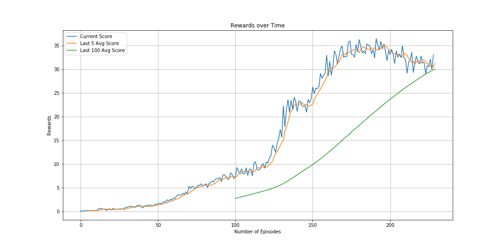
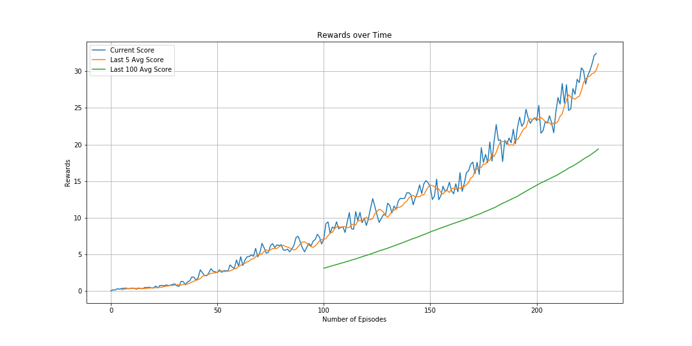
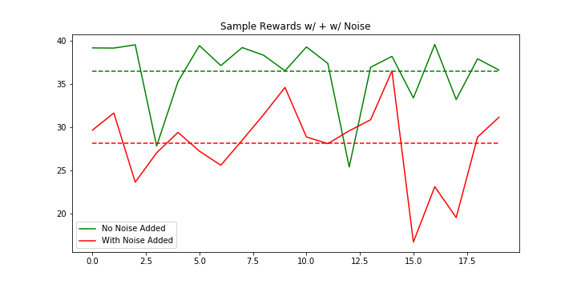

### Progression Toward Solution

#### Methods

A DDPG algorithm was used to solve the environment that used 20 agents. Both the code from the agent and the model was based on the implementation provided in the [ddpg-pendulum](https://github.com/udacity/deep-reinforcement-learning/blob/master/ddpg-pendulum/) example . Minor changes were made to account for 20 agents being simultaneously trained. Specifically, experiences were being accumulated much more quickly in the ReplayBuffer, and more recent states could be explored as opposed to if only a single agent were used.

As initial efforts to train the agent failed, each experiment was record by saving the hyperparameters and appending the rewards to a log file. 

#### Actor/Critic Network

While the original paper used two fully connected layers with 400 and 300 units respectively, it was felt that this was overkill for this environment as there were only 33 state inputs and 4 potential actions. A smaller network would likely converge faster. The actor/critic networks had the below structure:

```
"ACTOR": [
        "Actor(",
        "  (bn1): BatchNorm1d(33, eps=1e-05, momentum=0.1, affine=True, track_running_stats=True)",
        "  (fc1): Linear(in_features=33, out_features=128, bias=True)",
        "  (bn2): BatchNorm1d(128, eps=1e-05, momentum=0.1, affine=True, track_running_stats=True)",
        "  (fc2): Linear(in_features=128, out_features=128, bias=True)",
        "  (fc3): Linear(in_features=128, out_features=4, bias=True)",
        ")"
    ],
    "CRITIC": [
        "Critic(",
        "  (bn1): BatchNorm1d(33, eps=1e-05, momentum=0.1, affine=True, track_running_stats=True)",
        "  (fcs1): Linear(in_features=33, out_features=128, bias=True)",
        "  (bn2): BatchNorm1d(128, eps=1e-05, momentum=0.1, affine=True, track_running_stats=True)",
        "  (fc2): Linear(in_features=132, out_features=128, bias=True)",
        "  (fc3): Linear(in_features=128, out_features=1, bias=True)",
        ")"
    ]
```

Both relu and elu activations were tested, and the final solution uses some elu activations. However, my intuition is that the activation difference did not make a significant difference in the result. The next most important change was to add batch normalization as this would help "whiten" the inputs as shown above.

#### Hyperparameter Tuning - Negative Experiments

It was found that the DDPG algorithm was not completely stable. In fact, while different reward scores could be experienced depending simply on how the actor/critic networks were initialized. There were multiple hyperparameter scenarios that were attempted that typically resulted in the agent failing to solve the environment. To keep things consistent, the same actor/critic networks were used, and only other hyperparameters were changed. The following are examples of failed attempts.
* Increasing the learning beyond 3e-4 
* A smaller buffer size of 1e5
* A smaller batch size of 64 or a larger batch size of 256
* Initializing the local/target networks to be identical

#### Final Hyperparameters

 The below hyperparameter set resulted in the most consistent results when training. 

```
{
    "BUFFER_SIZE": 1000000,
    "BATCH_SIZE": 128,
    "GAMMA": 0.99,
    "TAU": 0.001,
    "LR_ACTOR": 0.0002,
    "LR_CRITIC": 0.0002,
    "WEIGHT_DECAY": 0,
}
```

It was found that batch noramlization was crucial to be able to solve the environment, which helps "whiten" the inputs to the rest of the layers.

#### Training the Agent

There were multiple failed scenarios in which when looking at an individual episode the agent could solve the environment, but not over an average of 100 episodes.


From this figure, it can be seen that the 100 episode average lags significantly behind how the agent actually is performing in its current timestep. In fact, the best agent performance was around episode 200, but continually training the agent resulted in detrimental updates.

This is an example of a successful training example in which the agent was able to solve the environment - but it can be seen from the curve that if the agent were to continue to train, the average would likely drop below 30


Due to this, the check to determine whether the agent had solved the environment was changed - instead of continuing to train the agent, once the agent was able to achieve a local average (as defined by the average reward over the past 5 episodes), training would stop, and the agent would best tested across 100 episodes. In addition, during the check, no noise would be added to the agent during the `act()` step. 


Eliminating the noise has significant results on evaluating the performance of the agent. Adding a parameter to slowly decrease the amount of nosie added as the agent progresses training may be beneficial to properly gauge agent performance



These two items led to the most consistent results. This is slightly analogous to  training a conventional ML model - in which continuing to train an model may lead to divergence from the ideal solution as overfitting occurs. The appropriate stopping criteria to achieve the best model was necessary to consistently solve the environment.

#### Future Steps

It would be interesting to implement D4PG as the current implementation is not "distributed" in the sense that multiple agents are not being simultaneously trained, despite that 20 agents are being used to generate experiences during training. Being able to tune the algorithm further for more stable convergence would also be interesting. Lastly, seeing if a continuous action space implementation of the PPO or A3C algorithm would lead to more stable results would also be interesting to try.
